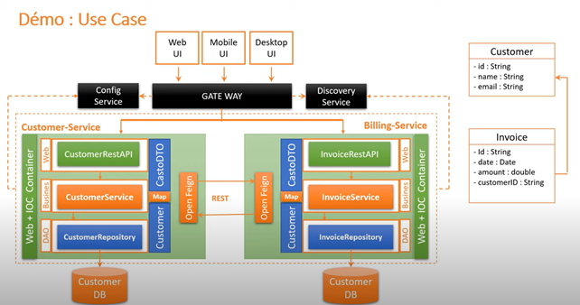
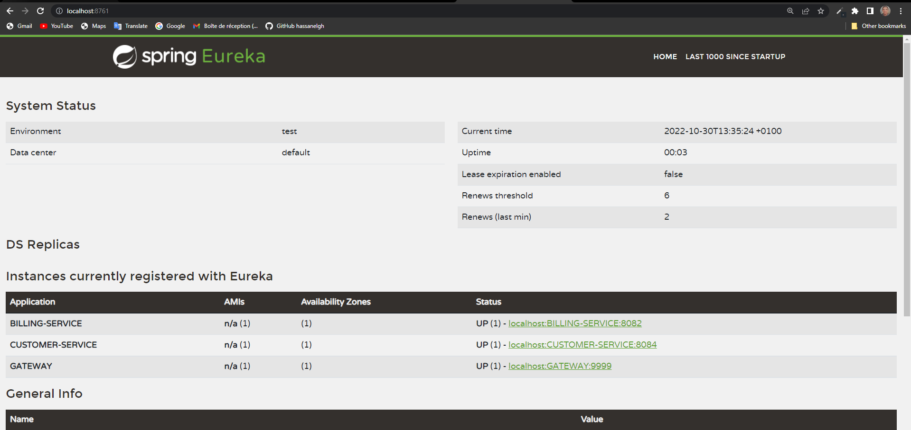
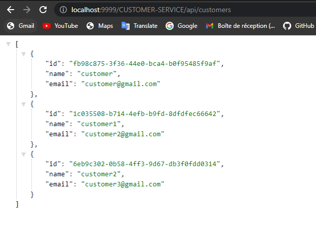
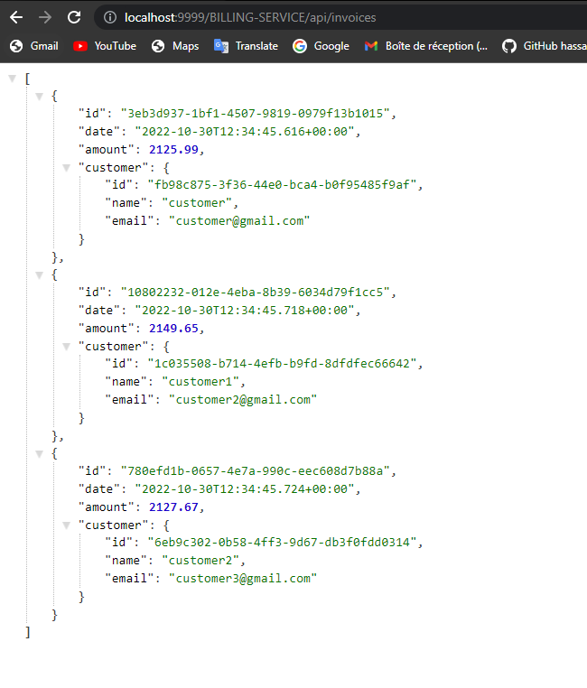
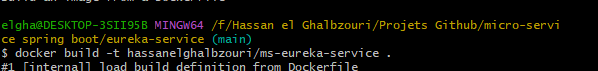
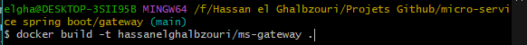
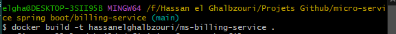

# micro-service spring boot

Mise en oeuvre d'une architecture micro-services en utilisant les bonnes pratiques  :
-	Couches DA0, Service, Web, DTO
-	Utilisation de MapStruct pour le mapping entre les objet Entities et DTO
-	Génération des API-DOCS en utilisant SWAGGER3 (Open API)
-	Communication entre micro-services en utilisant OpenFeign
-	Spring Cloud Gateway
-	Eureka Discovery Service
Après conteneuriser ces microservices à l'aide de Docker (en utilisant un Dockerfile), puis les déployer et les orchestrer à l'aide de Docker Compose ou Kubernetes

#### Use Case

### Code :

- [x] [Eureka Server](./eureka-service)
- [x] [Gateway](./gateway)
- [x] [Customer-Service](./customer-service)
- [x] [billing-Service](./billing-service)

### Test :

1. run eureka server :
2. run gateway :
4. run customer-service :
5. run billing-service : (`info : billing service utiliser customer-service pour initialiser database`)

#### result :
 - `localhost:8761` :
    
    

 - `http://localhost:9999/CUSTOMER-SERVICE/api/customers` :
    
    

 - `http://localhost:9999/BILLING-SERVICE/api/invoices`:
    
    

### Création des images : 
- JAR
- Dockerfiles:
    > eureka-service : [>>](./eureka-service/Dockerfile)

    > Gateway : [>>](./gateway/Dockerfile)

    > customer-service : [>>](./customer-service/Dockerfile)

    > billing-service : [>>](./billing-service/Dockerfile)

- build images :    

    
    
    
    

- result : 

    

