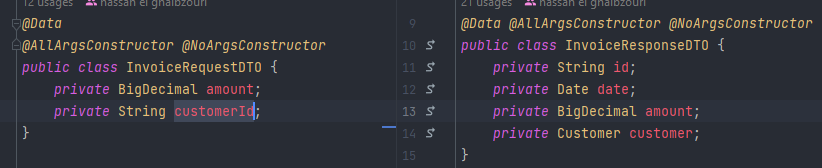

# Billing Service  :

### Dépendances et plugins :

        <dependency>
			<groupId>org.springframework.boot</groupId>
			<artifactId>spring-boot-starter-data-jpa</artifactId>
		</dependency>
		<dependency>
			<groupId>org.springframework.boot</groupId>
			<artifactId>spring-boot-starter-web</artifactId>
		</dependency>
		<dependency>
			<groupId>org.springframework.cloud</groupId>
			<artifactId>spring-cloud-starter-netflix-eureka-client</artifactId>
		</dependency>

		<dependency>
			<groupId>com.h2database</groupId>
			<artifactId>h2</artifactId>
			<scope>runtime</scope>
		</dependency>
        ...

-   [pom.xml](./pom.xml)

### Entities :
- customer [>>](./src/main/java/com/example/billingservice/entities/Customer.java) :

    

- Invoice  [>>](./src/main/java/com/example/billingservice/entities/Invoice.java):
  
    

###  repositories :

- InvoiceRepository [>>](./src/main/java/com/example/billingservice/repositories/InvoiceRepository.java):

    

### DTO :

- Création de deux entités dto le premier est `InvoiceRequestDTO` pour recevoir la requête de l’utilisateur, le deuxième est `InvoiceResponseDTO` est utilisé pour répondre aux utilisateurs : [>>](./src/main/java/com/example/billingservice/dto)
    

### Mappers :
- Pour faire le mapping entre les entités et les DTO on a utilisé `mapstruct`
    - InvoiceMapper [>>](./src/main/java/com/example/billingservice/mappers/InvoiceMapper.java):

   

### Exception :
- CustomerNotFoundException : [>>](./src/main/java/com/example/billingservice/exceptions/CustomerNotFoundException.java)
- InvoiceNotFoundException : [>>](./src/main/java/com/example/billingservice/exceptions/InvoiceNotFoundException.java)
- InvoiceSaveException (dans le cas l'utilisateur n'a pas entré l'un des attributes) : [>>](./src/main/java/com/example/billingservice/exceptions/InvoiceSaveException.java)

### OpenFeign :
- est utilisé pour la communication entre les micro-services 
- CustomerRestClient [>>](./src/main/java/com/example/billingservice/openfeign/CustomerRestClient.java):

   

### Services :
- InvoiceService :
  

- InvoiceServiceImpl  [>>](./src/main/java/com/example/billingservice/services/InvoiceServiceImpl.java)

### Web :
- InvoiceRestController [>>](./src/main/java/com/example/billingservice/web/InvoiceRestController.java)
    - `InvoiceRestController(InvoiceService invoiceService)`
    - `List<InvoiceResponseDTO>  Invoices()`
    - `InvoiceResponseDTO getInvoice(@PathVariable(name = "invoiceId") String invoiceId)`
    - `List<InvoiceResponseDTO> getInvoicesByCustomerId(@PathVariable(name = "customerId") String customerId)`
    - `InvoiceResponseDTO save(@RequestBody InvoiceRequestDTO invoiceRequestDTO)`
    - `ResponseEntity<String> exceptionsHandler(Exception e)`

### application.properties :

  

- [application.properties](./src/main/resources/application.properties)

### BillingServiceApplication :

  

- [BillingServiceApplication](./src/main/java/com/example/billingservice/BillingServiceApplication.java)

### Test :

- getAllInvoices :

  

- getInvoice :

  

    - Cas Invoice not found :

      

- postInvoice :

  

  - Cas enregistrer invoice sans customerId ou amount:

    
    
  - Cas customer id n'existe pas :

    
  
- getInvoice by customerId :

  

    - Cas Customer not found :

      

