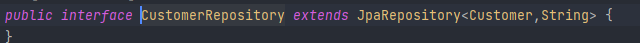

# Customer Service  :

### Dépendances et plugins :

        <dependency>
            <groupId>org.springframework.boot</groupId>
            <artifactId>spring-boot-starter-data-jpa</artifactId>
        </dependency>
        <dependency>
            <groupId>org.springframework.boot</groupId>
            <artifactId>spring-boot-starter-web</artifactId>
        </dependency>
        <dependency>
            <groupId>org.springframework.cloud</groupId>
            <artifactId>spring-cloud-starter-netflix-eureka-client</artifactId>
        </dependency>

        <dependency>
            <groupId>com.h2database</groupId>
            <artifactId>h2</artifactId>
            <scope>runtime</scope>
        </dependency>
        ...

-   [pom.xml](./pom.xml)

### Entities :
-   customer [>>](./src/main/java/com/example/customerservice/entities/Customer.java) :

    

    
###  repositories :

- customerRepository [>>](./src/main/java/com/example/customerservice/repositories/CustomerRepository.java):

    

### DTO :

- Création de deux entités dto le premier est `CustpmerRequestDTO` pour recevoir la requête de l’utilisateur, le deuxième est `CustomerResponseDTO` est utilisé pour répondre aux utilisateurs : [>>](./src/main/java/com/example/customerservice/dto)

    

### Mappers :
- Pour faire le mapping entre les entités et les DTO on a utilisé `mapstruct`  
  - CustomerMapper [>>](./src/main/java/com/example/customerservice/mappers/CustomerMapper.java):
  
   

### Exception :
- CustomerNotFoundException : [>>](./src/main/java/com/example/customerservice/exceptions/CustomerNotFoundException.java)
- CustomerSaveException (dans le cas l'utilisateur n'a pas entré l'un des attributes) : [>>](./src/main/java/com/example/customerservice/exceptions/CustomerSaveException.java)

### Services :
- CustomerService :
  

- CustomerServiceImpl  [>>](./src/main/java/com/example/customerservice/services/CustomerServiceImpl.java)

### Web :
- CustomerRestAPI [>>](./src/main/java/com/example/customerservice/web/CustomerRestAPI.java)
  - `List<CustomerResponseDTO> allCustomers()`
  - `CustomerResponseDTO getCustomer(@PathVariable(name = "customerId") String customerId)`
  - `CustomerResponseDTO save(@RequestBody CustomerRequestDTO customerRequestDTO)`
  - `CustomerResponseDTO update(@RequestBody CustomerRequestDTO customerRequestDTO)`
  - `ResponseEntity<String> exceptionsHandler(Exception e)`

### application.properties :

  

- [application.properties](./src/main/resources/application.properties)

### CustomerServiceApplication :

  

- [CustomerServiceApplication](./src/main/java/com/example/customerservice/CustomerServiceApplication.java)

### Test :

- getAllCustomers :

  

- getCustomer :

  

  - Cas Customer not found :

    

- putCustomer :

  

  - Cas Customer not found :

    

- postCustomer :

  

  - Cas enregistrer customer sans email ou name:

    
