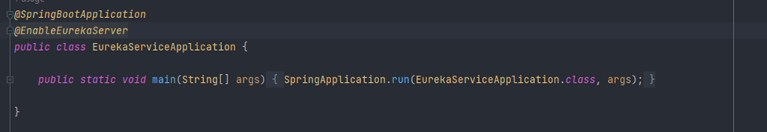
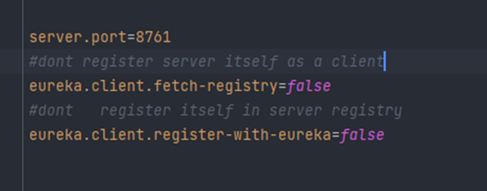

# Eureka Server :

### Dépendances :

		<dependency>
			<groupId>org.springframework.cloud</groupId>
			<artifactId>spring-cloud-starter-netflix-eureka-server</artifactId>
		</dependency>
		<dependency>
			<groupId>org.springframework.boot</groupId>
			<artifactId>spring-boot-starter-test</artifactId>
			<scope>test</scope>
		</dependency>

-   [pom.xml](https://github.com/hassanelgh/micro-service-spring-boot/blob/main/eureka-service/pom.xml)

### EurekaServiceApplication :

- il faut ajouter  `@EnableEurekaServer`:

- [EurekaServiceApplication](https://github.com/hassanelgh/micro-service-spring-boot/blob/main/eureka-service/src/main/java/com/example/eurekaservice/EurekaServiceApplication.java)

### application.properties :

- [application.properties](https://github.com/hassanelgh/micro-service-spring-boot/blob/main/eureka-service/src/main/resources/application.properties)

