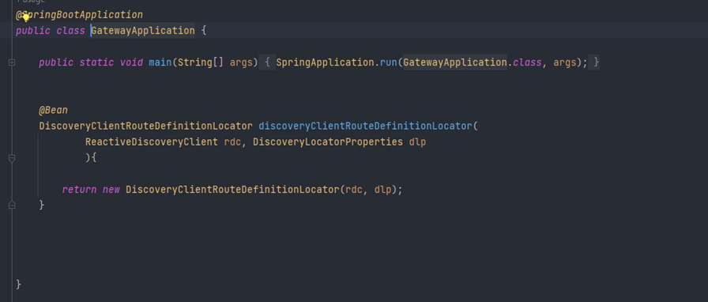
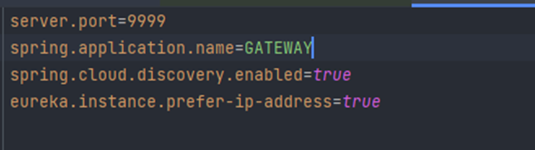

# Gateway :

### Dépendances :

        <dependency>
            <groupId>org.springframework.cloud</groupId>
            <artifactId>spring-cloud-starter-gateway</artifactId>
        </dependency>

        <dependency>
            <groupId>org.springframework.boot</groupId>
            <artifactId>spring-boot-starter-test</artifactId>
            <scope>test</scope>
        </dependency>
        <dependency>
            <groupId>org.springframework.cloud</groupId>
            <artifactId>spring-cloud-starter-netflix-eureka-client</artifactId>
        </dependency>

-   [pom.xml](https://github.com/hassanelgh/micro-service-spring-boot/blob/main/gateway/pom.xml)

### GatewayApplication :

- [GatewayApplication](https://github.com/hassanelgh/micro-service-spring-boot/blob/main/gateway/src/main/java/com/example/gateway/GatewayApplication.java)

### application.properties :

- [application.properties](https://github.com/hassanelgh/micro-service-spring-boot/blob/main/gateway/src/main/resources/application.properties)

